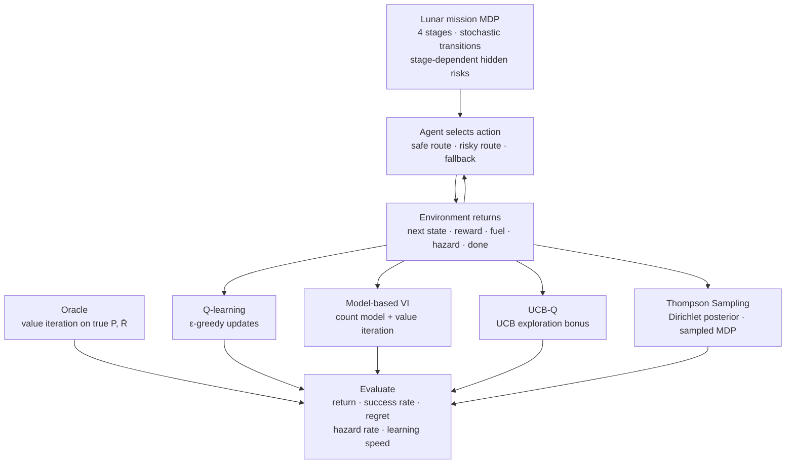

# Artemis — Safe and Fuel-Efficient Decision Making in an Uncertain Lunar Mission

**Course:** Reinforcement Learning and Decision Making Under Uncertainty  
**Authors:** Mateo Lopez · Marta Visetti · Sanika Deore

---

## Overview

This project investigates whether uncertainty-aware exploration methods can learn safer and more fuel-efficient strategies than standard Q-learning in a simplified lunar mission planning problem. A spacecraft must navigate four sequential mission stages by choosing between a safe route, a risky but fuel-efficient route, and a one-time fallback maneuver. The route outcomes are stochastic and unknown to the agent — they must be learned through repeated interaction.

Four tabular RL algorithms are implemented and compared against an oracle computed by value iteration on the true MDP:

- **Q-learning** — ε-greedy tabular baseline  
- **UCB-Q** — count-based upper confidence exploration bonus  
- **Model-based VI** — agent learns the transition model from counts, then re-plans with value iteration  
- **Thompson Sampling (PSRL)** — samples a full MDP from a Dirichlet posterior each episode, then acts greedily on it  

---

## Workflow



---

## MDP Formulation

| Component | Specification |
|---|---|
| **Stages** | 1 = Launch, 2 = Earth departure, 3 = Midcourse transfer, 4 = Lunar approach, 5 = Mission completion |
| **State** | (stage, fuel ∈ {0,1,2}, hazard ∈ {0,1}, fallback used ∈ {0,1}) — 48 non-terminal states |
| **Actions** | Safe route · Risky route · Fallback maneuver |
| **Initial state** | Stage 1, fuel = 2 (high), hazard = normal, fallback = available |
| **Terminal success** | Reach stage 5 with fuel > 0 |
| **Terminal failure** | Catastrophic transition or fuel drops below 0 |

**Transition rules (summary):**
- *Safe:* always advances; costs 1 fuel; 5 % chance of entering hazard.
- *Risky:* advances with 0 fuel cost on the safe branch (55–75 % depending on stage); costs 1 fuel on the hazard branch (20–25 %); catastrophic failure branch (5–20 %, doubled under hazard status).
- *Fallback (once per episode):* advances; costs 1 fuel; clears hazard with 90 % probability.

**Rewards:** +10 stage advance · +50 mission success bonus · −5 enter hazard · −10 use fallback · −100 mission failure.

The key tension is that risky preserves fuel on its safe branch — a strategic advantage over four stages — but accumulating hazard status doubles the catastrophic failure probability.

---

## File Structure

```
Artemis-risk-aware-RL/
├── notebooks/
│   └── Artemis_main.ipynb      # main entry point — all experiments run here
├── src/artemis/
│   ├── constants.py            # action/state indices, risky-route probability tables
│   ├── environment.py          # LunarMissionEnv, state encoding, action masks,
│   │                           #   analytical P and R builder
│   ├── planning.py             # vectorised value iteration, oracle policy
│   ├── experiments.py          # RunConfig, run_episode, run_sweep
│   └── agents/
│       ├── q_learning.py       # Q-learning
│       ├── ucb.py              # UCB-Q
│       ├── model_based.py      # model-based VI
│       └── thompson.py         # Thompson sampling (PSRL)
├── assets/                     # figures exported from the notebook
├── tests/
│   └── test_environment.py     # unit and Monte-Carlo environment tests
├── pyproject.toml
└── requirements.txt
```

---

## How to Reproduce

```bash
# 1. install
pip install -e ".[notebook]"

# 2. open notebook
jupyter notebook notebooks/Artemis_main.ipynb

# 3. run all cells top to bottom
```

All hyperparameters are defined in the `AGENT_KWARGS` cell near the top of the notebook. Results are deterministic across the five fixed seeds.

```bash
# optional: run unit tests
pytest tests/ -v
```

---

## Results

### Verification (§ 2)

Before any training, the notebook verifies the MDP implementation against the proposal specification: transition row sums, risky-route probability tables, terminal absorbing conditions, and reward spot-checks all pass. Value iteration on the true model yields an **oracle success rate of 47.8 %** (confirmed by 10 000 Monte-Carlo rollouts), which serves as the upper bound for any learning algorithm on this MDP.

---

### Single-run learning curves (§ 3 — 600 episodes, 1 seed)


All four agents improve from the first episode. Q-learning and UCB rise earliest due to direct Q-value updates. Model-based VI converges more gradually as its transition model accumulates reliable counts. Thompson Sampling shows higher early variance from sampling diverse MDPs, but stabilises by episode 300.

---

### Multi-seed sweep (§ 4 — 2 000 episodes × 5 seeds)


Shaded bands show mean ± std across five seeds. All agents converge well before episode 2 000. UCB achieves the lowest cumulative regret by directing exploration toward under-visited state–action pairs. Model-based VI matches UCB on success rate once its learned model is stable. Thompson exhibits the highest early variance but converges to a comparable policy. The hazard rate panel shows that agents taking more risky actions (UCB, model-based) enter hazard slightly more often but still outperform strategies that default to safe.

**Summary table — mean of last 100 episodes, 5 seeds:**

| Agent | Success rate | % of oracle | Mean return | Hazard rate | Cum. regret |
|---|---|---|---|---|---|
| **UCB** | **0.344** | **72 %** | **−22.9** | 0.127 | **48 853** |
| Model-based VI | 0.326 | 68 % | −27.1 | 0.127 | 58 935 |
| Q-learning | 0.318 | 66 % | −27.7 | 0.122 | 63 060 |
| Thompson | 0.284 | 59 % | −32.2 | 0.106 | 71 485 |

*Oracle ceiling: 0.478 success / −1.1 mean return.*


UCB leads on success rate and return and accumulates the least regret. Model-based VI is competitive once its model is warm, confirming the proposal's prediction that structured methods benefit from the small state space. Q-learning is a strong and consistent baseline. Thompson underperforms in terms of final success but matches in hazard rate, reflecting its more cautious sampled policies.

---

### Environment variants (§ 5)


| Variant | Modification | Key finding |
|---|---|---|
| `harsh_hazard` | Hazard penalty −10 (was −5) | All agents become more conservative; ~15 % success drop |
| `low_fuel` | Start fuel = 1 (was 2) | Hardest setting; margins collapse; UCB still leads |
| `risky_x2` | Risky failure prob ×2 | Agents shift toward safe; success drops for risk-heavy strategies |
| `weak_fallback` | Fallback recovery prob 50 % (was 90 %) | Minimal impact; fallback rarely used across all agents |

UCB and Q-learning are the most robust across variants (mean success 0.272 and 0.265 respectively). Thompson is most sensitive to environmental difficulty, consistent with its high reliance on early posterior accuracy.

---

### Learned policy heatmaps (§ 6 — oracle vs. agents)


Each cell shows the greedy action at a given (stage, fuel) combination after 2 000 episodes of training (hazard = 0, fallback available). All four learned policies closely match the oracle: risky at early stages with sufficient fuel (preserves fuel for later), safe at the final stage with high fuel (locks in success without catastrophic risk). This confirms that all agents have internalised the core risk–fuel trade-off described in the proposal.

---

## Claim Verification (§ 7)

All three predictions from the proposal are confirmed:

```
Claim: UCB/Thompson beat Q-learning on success rate.
  Q-learning = 0.318;  best(UCB, Thompson) = 0.344  =>  CONFIRMED

Claim: UCB/Thompson have lower cumulative regret than Q-learning.
  Q-learning regret = 63 060;  best(UCB, Thompson) = 48 853  =>  CONFIRMED

Claim: Model-based VI performs strongly once enough data is collected.
  Model-based success = 0.326 (best overall = 0.344 by UCB)  =>  CONFIRMED
```

The one caveat aligned with the proposal's own warning: the oracle success ceiling of 47.8 % means no agent can achieve very high absolute success rates on this MDP. The results are therefore best interpreted relative to the oracle, where UCB reaches 72 % and model-based VI reaches 68 %.
