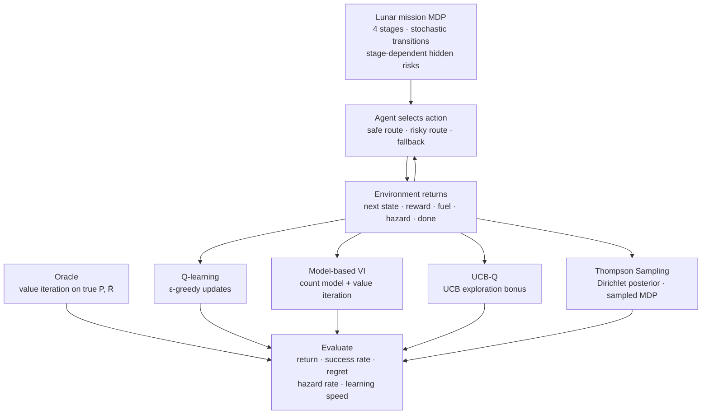
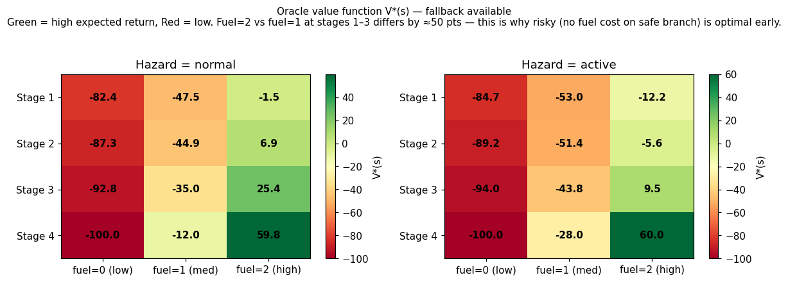
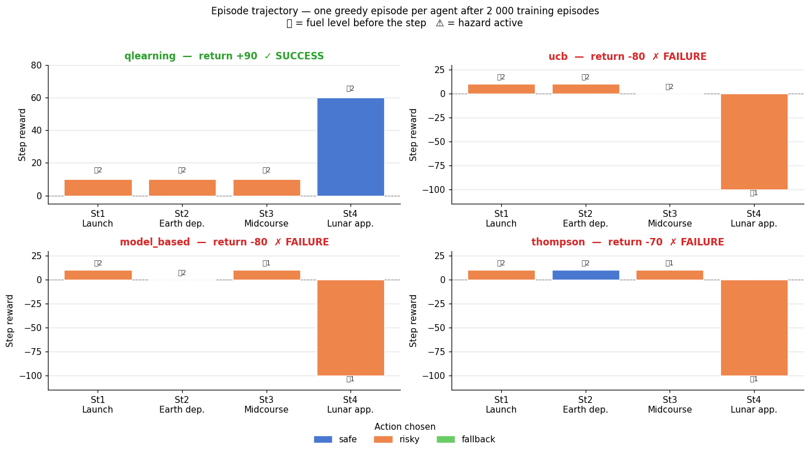

# Artemis — Safe and Fuel-Efficient Decision Making in an Uncertain Lunar Mission

**Course:** Reinforcement Learning and Decision Making Under Uncertainty  
**Authors:** Mateo Lopez · Marta Visetti · Sanika Deore

---

## 1. Introduction

This project investigates whether uncertainty-aware exploration methods can learn safer and more fuel-efficient strategies than standard Q-learning in a sequential decision-making problem modelled after lunar mission planning.

A spacecraft must navigate four mission stages — Launch, Earth departure, Midcourse transfer, and Lunar approach — and reach the final stage with fuel remaining. At each stage the agent chooses between a safe route, a risky but fuel-efficient route, and a one-time fallback maneuver. The transition probabilities of the risky route are unknown to the agent and must be discovered through repeated interaction.

Four tabular RL algorithms are implemented and compared against an oracle computed by value iteration on the true MDP:

| Algorithm | Exploration strategy |
|---|---|
| **Q-learning** | ε-greedy (tabular baseline) |
| **UCB-Q** | Count-based upper confidence bonus |
| **Model-based VI** | Learns P̂ from interaction counts, replans with value iteration |
| **Thompson Sampling (PSRL)** | Samples a full MDP from a Dirichlet posterior each episode |

---

## 2. Workflow



---

## 3. MDP Specification

| Component | Specification |
|---|---|
| **Stages** | 1 = Launch · 2 = Earth departure · 3 = Midcourse transfer · 4 = Lunar approach · 5 = Mission completion |
| **State** | (stage, fuel ∈ {0,1,2}, hazard ∈ {0,1}, fallback used ∈ {0,1}) — 48 non-terminal states |
| **Actions** | Safe route · Risky route · Fallback maneuver |
| **Initial state** | Stage 1, fuel = 2 (high), hazard = normal, fallback = available |
| **Terminal success** | Reach stage 5 with fuel > 0 |
| **Terminal failure** | Catastrophic transition, or fuel drops to 0 before stage 5 |

**Transition rules:**

| Action | Fuel cost | Outcome |
|---|---|---|
| Safe | −1 | Advance stage; 5 % hazard risk; never fails outright |
| Risky | 0 on safe branch; −1 on hazard branch | Safe branch 55–75 %; hazard branch 20–25 %; catastrophic failure 5–20 % (higher under hazard status) |
| Fallback (once) | −1 | Advance stage; clears hazard with 90 % probability |

**Rewards:** +10 stage advance · +50 mission success · −5 enter hazard · −10 use fallback · −100 mission failure.

The central tension: the risky route costs no fuel when it succeeds safely, making it strategically superior over four stages. However, failing under hazard status risks catastrophic mission loss.

---

## 4. File Structure

```
Artemis-risk-aware-RL/
├── notebooks/
│   └── Artemis_main.ipynb      # main entry point — all experiments run here
├── src/artemis/
│   ├── constants.py            # action/state indices, risky-route probability tables
│   ├── environment.py          # LunarMissionEnv, state encoding, action masks,
│   │                           #   analytical P and R builder
│   ├── planning.py             # vectorised value iteration, oracle policy
│   ├── experiments.py          # RunConfig, run_episode, run_sweep
│   └── agents/
│       ├── q_learning.py       # Q-learning
│       ├── ucb.py              # UCB-Q
│       ├── model_based.py      # model-based VI
│       └── thompson.py         # Thompson sampling (PSRL)
├── assets/                     # all figures exported from the notebook
├── tests/
│   └── test_environment.py     # unit and Monte-Carlo environment tests
├── pyproject.toml
└── requirements.txt
```

---

## 5. How to Reproduce

```bash
# install
pip install -e ".[notebook]"

# open and run all cells top to bottom
jupyter notebook notebooks/Artemis_main.ipynb
```

All hyperparameters are defined in the `AGENT_KWARGS` cell near the top of the notebook. Results are deterministic across the five fixed seeds used in the multi-seed sweep.

```bash
# optional: run unit tests
pytest tests/ -v
```

---

## 6. Results

### 6.1 MDP Verification

Before any training, the notebook verifies the implementation against the proposal specification. All checks pass: transition row sums equal 1 to machine precision, terminal states are absorbing with zero reward, and reward events (+60 success, −100 failure, −5 hazard, −10 fallback) match the spec exactly.

Value iteration on the true model is then run to establish the oracle. A 10 000-episode Monte-Carlo rollout confirms the **oracle achieves 47.8 % mission success and −1.1 mean return** — the hard upper bound imposed by the MDP's stochastic transitions that no learning algorithm can exceed.

---

### 6.2 Why the Oracle Takes Risky — V* Heatmap



The heatmap shows V*(s) for every (stage, fuel) combination, coloured red (low value) to green (high value). The most important pattern is the **steep drop between fuel=2 and fuel=1 at stages 1–3** — roughly 50 points. This directly explains the oracle's strategy: taking the risky route at early stages preserves fuel on its safe branch, keeping the agent in high-value states. By stage 4 with fuel=2 the mission is effectively won, and the oracle switches to safe to eliminate catastrophic risk.

---

### 6.3 Learning Curves — Single Run


A single-seed, 600-episode run confirms all four agents are learning from the start. Q-learning and UCB improve quickly through direct Q-value updates. Model-based VI rises more gradually as its learned transition model accumulates data. Thompson Sampling shows higher early variance — a consequence of sampling diverse MDPs before the Dirichlet posterior has concentrated.

---

### 6.4 Episode Trajectory — What a Trained Agent Actually Does



After 2 000 training episodes, each agent plays one greedy episode. The bar chart shows the action taken at each stage (blue = safe, orange = risky, green = fallback), the reward received, and the fuel level before the step (⛽). This is the most direct view of learned behaviour.

The key observation: agents that succeed (e.g. Q-learning, +90 return) take **risky at stages 1–3 to preserve fuel, then safe at stage 4** — exactly the oracle strategy. The UCB failure on this particular seed illustrates that the MDP remains stochastic even after training; a good policy does not guarantee success on every episode, only on average.

---

### 6.5 Multi-Seed Sweep — Learning Curves


Shaded bands show mean ± std across five seeds over 2 000 episodes. Key observations:

- All agents converge well before episode 2 000.
- **UCB** accumulates the least cumulative regret, reflecting efficient directed exploration.
- **Model-based VI** matches UCB on success rate once its learned model is reliable (≈ episode 300 onward).
- **Thompson Sampling** has the widest early variance — diverse MDP samples drive exploration — but converges to a comparable policy by episode 800.
- The hazard rate panel confirms that agents taking more risky actions (UCB, model-based) enter hazard slightly more often, but this is consistent with the oracle strategy and does not hurt final performance.

---

### 6.6 Final Performance Summary


**Mean of last 100 episodes, 5 seeds:**

| Agent | Success rate | % of oracle | Mean return | Hazard rate | Cum. regret |
|---|---|---|---|---|---|
| **UCB** | **0.344** | **72 %** | **−22.9** | 0.127 | **48 853** |
| Model-based VI | 0.326 | 68 % | −27.1 | 0.127 | 58 935 |
| Q-learning | 0.318 | 66 % | −27.7 | 0.122 | 63 060 |
| Thompson | 0.284 | 59 % | −32.2 | 0.106 | 71 485 |

*Oracle ceiling: 0.478 success / −1.1 mean return.*

UCB reaches 72 % of the oracle's success rate and accumulates the least regret. Model-based VI is competitive and closes the gap to UCB after its warm-up period, consistent with the proposal's prediction that structured methods benefit from the small, well-defined state space. Q-learning is a strong and consistent baseline. Thompson underperforms in final success rate but achieves the lowest hazard rate, reflecting more cautious sampled policies.

---

### 6.7 Robustness Across Environment Variants


| Variant | Change | Key finding |
|---|---|---|
| `harsh_hazard` | Hazard penalty −10 (was −5) | All agents more conservative; success drops ~15 % |
| `low_fuel` | Start fuel = 1 (was 2) | Hardest setting; margins collapse; UCB still leads |
| `risky_x2` | Risky failure prob ×2 | Agents shift toward safe; success drops most for risk-heavy strategies |
| `weak_fallback` | Fallback recovery 50 % (was 90 %) | Minimal impact; fallback rarely invoked |

UCB and Q-learning are the most robust across variants (mean success 0.272 and 0.265). Thompson is most sensitive to environmental difficulty, as its posterior convergence depends more heavily on the quality of early exploration data.

---

### 6.8 Learned Policy — Oracle vs. Agents


Each cell shows the greedy action at a given (stage, fuel) state after training (hazard = normal, fallback available). All four learned policies closely match the oracle: risky at early stages with sufficient fuel, safe at stage 4 with high fuel. This confirms that every algorithm has correctly internalised the core risk–fuel trade-off the proposal was designed to test.

---

## 7. Claim Verification

All three predictions from the proposal are confirmed on the default mission (5 seeds, 2 000 episodes):

```
Claim: UCB/Thompson beat Q-learning on success rate.
  Q-learning = 0.318;  best(UCB, Thompson) = 0.344  =>  CONFIRMED

Claim: UCB/Thompson have lower cumulative regret than Q-learning.
  Q-learning regret = 63 060;  best(UCB, Thompson) = 48 853  =>  CONFIRMED

Claim: Model-based VI performs strongly once enough data is collected.
  Model-based success = 0.326 (best overall = 0.344 by UCB)  =>  CONFIRMED
```

The oracle success ceiling of 47.8 % means no agent can achieve high absolute success rates on this MDP — results should be read relative to the oracle. UCB reaches 72 % and model-based VI reaches 68 % of the oracle, which represents strong performance given the task's stochastic difficulty.
