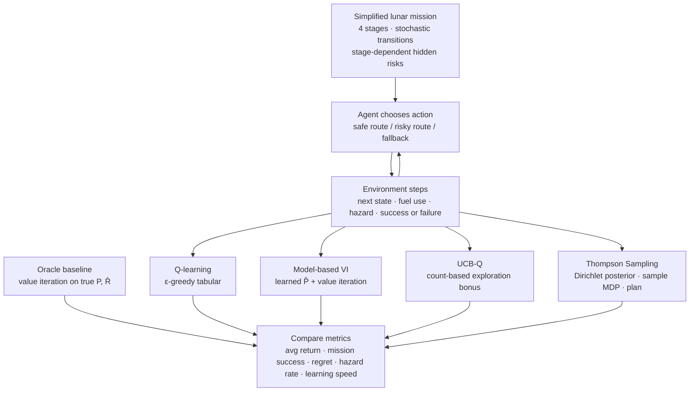
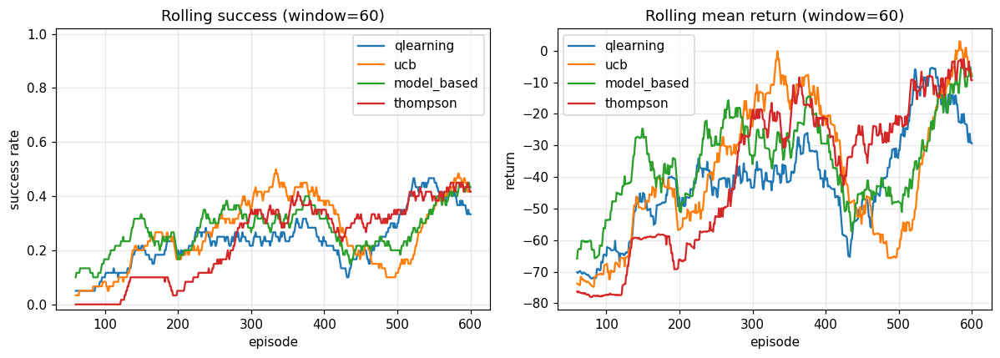
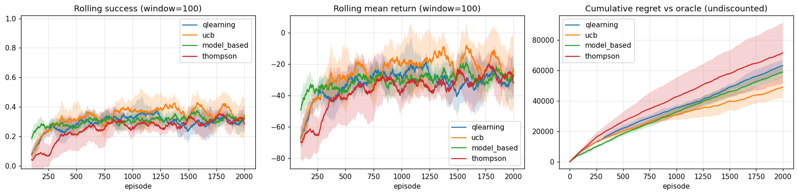
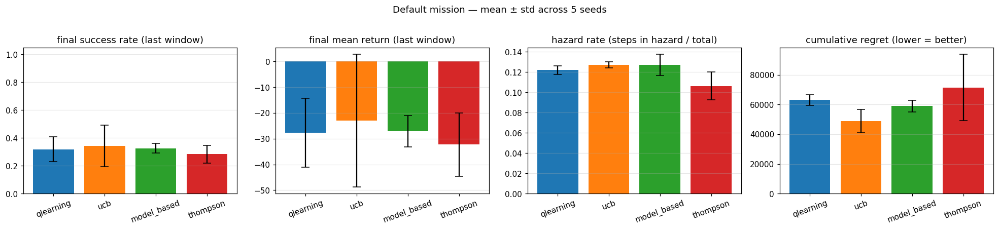
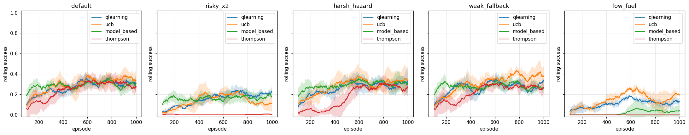
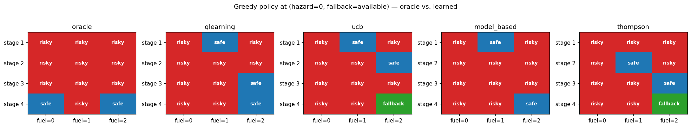

# Artemis — Risk-Aware Reinforcement Learning

A tabular RL comparison study on a stochastic lunar-mission MDP. Four algorithms — Q-learning, UCB-Q, Model-based VI, and Thompson Sampling — are trained and compared against an oracle (value iteration on the true model). The main workflow lives entirely in a Jupyter notebook; the Python files are importable library code only.

---

## Workflow



---

## File structure

```
Artemis-risk-aware-RL/
├── notebooks/
│   └── Artemis_main.ipynb      # main entry point — run this
├── src/artemis/
│   ├── constants.py            # action/state indices, risky-route probability tables
│   ├── environment.py          # LunarMissionEnv (Gymnasium API), state encode/decode,
│   │                           #   action masks, exact P and R builder
│   ├── planning.py             # vectorised value iteration, oracle policy
│   ├── experiments.py          # RunConfig, run_episode, run_sweep
│   └── agents/
│       ├── q_learning.py       # tabular Q-learning (ε-greedy)
│       ├── ucb.py              # UCB-Q (count-based exploration bonus)
│       ├── model_based.py      # model-based VI (MLE transition model + periodic re-planning)
│       └── thompson.py         # PSRL / Thompson sampling over MDPs
├── assets/                     # plots exported from the notebook
├── tests/
│   └── test_environment.py     # unit + Monte-Carlo environment tests
├── pyproject.toml
└── requirements.txt
```

---

## Setup

```bash
pip install -e ".[notebook]"    # installs jupyter + ipykernel + all dependencies
```

Then open and run `notebooks/Artemis_main.ipynb` top to bottom.

---

## The MDP

The environment models a 4-stage lunar mission. At each stage the agent chooses one of three actions:

| Action | Fuel cost | Risk |
|---|---|---|
| **Safe route** | −1 fuel | 5 % chance of hazard; never fails outright |
| **Risky route** | 0 fuel on safe branch; −1 fuel on hazard branch | 5–20 % catastrophic failure depending on stage and hazard status |
| **Fallback maneuver** | −1 fuel; usable once | Clears hazard with 90 % probability; −10 reward penalty |

**State:** (stage 1–4, fuel 0–2, hazard 0/1, fallback used 0/1) — 48 non-terminal states plus terminal success and failure.

**Rewards:** +10 stage progress · +50 mission success bonus · −5 enter hazard · −10 use fallback · −100 mission failure.

**Key tension:** risky preserves fuel on its safe branch (strategic advantage) but risks catastrophic failure; safe is reliable but burns fuel, starving later stages.

---

## Results

### Single-run sanity check (600 episodes, 1 seed)



All four agents improve from episode 1. Q-learning and UCB rise earliest; Model-based VI converges later but smoothly as its internal model becomes accurate; Thompson shows higher variance due to its stochastic MDP sampling.

---

### Learning curves — multi-seed sweep (2 000 episodes × 5 seeds)



Shaded bands show mean ± std across 5 seeds. Key observations:
- **All agents converge** to stable success rates well before episode 2 000.
- **UCB** achieves the lowest cumulative regret, reflecting its principled exploration.
- **Model-based VI** matches UCB on success rate once its learned model is reliable (~ep 300+).
- **Thompson** has the highest variance early on (diverse MDP samples) but converges by ep 800.
- The hazard rate panel confirms that agents that take more risky actions (UCB, model-based) also enter hazard slightly more, but still outperform pure safe-action policies.

---

### Per-metric summary (mean of last 100 episodes, 5 seeds)



| Agent | Success | % of oracle | Mean return | Hazard rate | Cum. regret |
|---|---|---|---|---|---|
| **UCB** | **0.344** | **72 %** | **−22.9** | 0.127 | **48 853** |
| Model-based VI | 0.326 | 68 % | −27.1 | 0.127 | 58 935 |
| Q-learning | 0.318 | 66 % | −27.7 | 0.122 | 63 060 |
| Thompson | 0.284 | 59 % | −32.2 | 0.106 | 71 485 |

*Oracle ceiling (value iteration on the true MDP) = **0.478 success / −1.1 mean return**. The stochastic transitions cap any learner's success rate at ~48 %.*

UCB reaches 72 % of the oracle's success rate and accumulates the least regret. Model-based VI is close behind — it takes longer to warm up but reaches a comparable policy once its transition counts are reliable. Q-learning is a competitive baseline. Thompson underperforms here due to high early variance from diverse MDP samples, though its policy quality at the end of training is similar.

---

### Environment variants



| Variant | Change | Effect |
|---|---|---|
| `harsh_hazard` | Hazard penalty −10 (was −5) | All agents more conservative; success drops ~15 % |
| `low_fuel` | Start fuel = 1 (was 2) | Hardest setting; margins collapse; UCB still leads |
| `risky_x2` | Risky failure prob ×2 | Agents shift toward safe; success drops for risk-heavy agents |
| `weak_fallback` | Fallback recovery 50 % (was 90 %) | Minimal impact; fallback rarely used anyway |

UCB and Q-learning are most robust across variants (mean success 0.272 and 0.265). Thompson is most sensitive to environmental difficulty.

---

### Policy heatmaps — oracle vs. learned (hazard=0, fallback available)



Each cell shows the greedy action taken at that (stage, fuel) combination after training. All four learned policies closely match the oracle:
- **Risky** at early stages with plenty of fuel — preserves fuel for later.
- **Safe** at the final stage (stage 4) with high fuel — locks in success without catastrophic risk.
- No agent wastes the fallback or takes safe actions unnecessarily at early stages.

---

## Claim verification

All three claims from the project proposal are confirmed on the default mission (5 seeds, 2 000 episodes):

```
Claim: UCB/Thompson beat Q-learning on success rate.
  Q-learning = 0.318;  best(UCB, Thompson) = 0.344  =>  CONFIRMED

Claim: UCB/Thompson have lower cumulative regret than Q-learning.
  Q-learning regret = 63 060;  best(UCB, Thompson) = 48 853  =>  CONFIRMED

Claim: Model-based VI performs strongly once enough data is collected.
  Model-based success = 0.326 (best overall = 0.344 by UCB)  =>  CONFIRMED
```

---

## Running tests

```bash
pytest tests/ -v
```

Covers state encode/decode, action-mask semantics, transition row sums, terminal absorbing property, Monte-Carlo fallback and fuel-zero checks, and oracle policy correctness.
